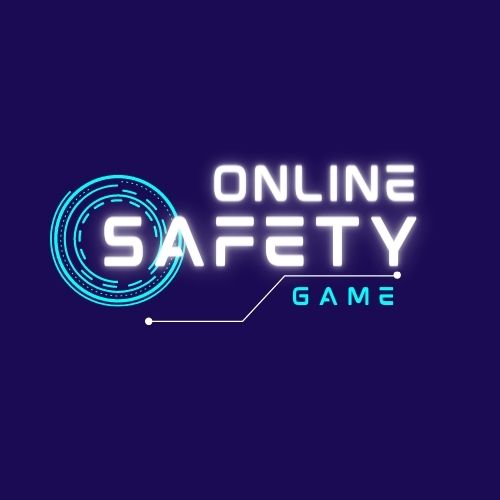

[OnlineSafetyGame](https://chainlink-hack-frontend.vercel.app/)

OnlineSafetyGame
================

[](https://opensource.org/licenses/MIT) 
[](https://github.com/bayurzx/OnlineSafetyGame/issues) 
[](https://github.com/bayurzx/OnlineSafetyGame/stargazers)

An immersive web-based game that educates users about online safety and emerging technology while providing an engaging and entertaining experience.


Inspiration
-----------

🌟 The inspiration behind the OnlineSafetyGame stems from the rapid advancements in technology, particularly in the field of Artificial Intelligence (AI). We were motivated by the realization that as technology becomes more prevalent in our lives, it is crucial to bring as many individuals as possible along for the ride, regardless of their technical expertise. We believe that everyone has a responsibility to navigate the online world safely and responsibly, and we wanted to create a project that bridges the gap between technology and user education. The world is changing fast, and we all have a part in it! 🌟

Features
--------

### 🚀 At the front...

-   Interactive Gameplay: Engage in a captivating game environment that combines storytelling, decision-making scenarios, and quizzes to teach users about online safety.
-   Educational Content: Explore various topics related to online safety and emerging technologies through interactive modules and engaging challenges.
-   Real-Life Scenarios: Experience realistic situations where users must make informed choices to promote safe online practices and understand the consequences of their actions.
-   Reward System: Compete with other players to achieve high scores and earn rewards, encouraging healthy competition and learning.
-   Responsive Design: Enjoy a seamless and immersive gaming experience on desktop, tablet, or mobile devices.

### ⚙️ At the back...

-   Player Management: Keep track of player information, scores, and participation history to provide a personalized experience.
-   Gameplay and Scoring: Handle quiz logic and scoring to calculate player scores based on correct answers within a fixed duration.
-   Reward Distribution: Automatically determine top performers and distribute rewards, including Ethereum (ETH), to acknowledge their achievements.
-   Game Reset: Implement an upkeep system to periodically reset the game based on predetermined factors, allowing new players to participate and compete for rewards.

Technologies Used
-----------------

#### 💻 Frontend:

-   Framework: React.js, Next.js
-   Styling: Tailwind CSS
-   Testing: Cypress

#### ⚙️ Backend:

-   Smart Contracts: Solidity, Hardhat
-   Deployment: CircleCI, AWS, Vercel

#### 🔗 Integration:

-   Chainlink: VRF (Verifiable Random Function) nodes
-   Chainlink Automations

## Installation Backend
------------

1.  Clone the repository:

``` sh
git clone https://github.com/bayurzx/OnlineSafetyGame.git
cd backend
```
2.  Install dependencies:

``` sh
cd OnlineSafetyGame
yarn
```
    

3.  Set up the environment variables:
    -   Create a `.env` file in the root directory
    -   Define the required environment variables (e.g., API keys, Ethereum provider)

```sh
yarn dev
```

**Note**: You don't need to do anything if you decie to use my contract. Contact me below

## Installation Frontend
------------


1.  Go to frontend and Install dependencies:

``` sh
cd frontend
yarn
```

2.  Set up the environment variables:
    -   Create a `.env` file in the root directory
    -   Define the required environment variables (e.g., API keys, Ethereum provider)
    
3.  Start the application:

```sh
yarn dev
```

4.  Open the app in your browser at `http://localhost:3000`.


Contributions
-------------

We welcome contributions from the open-source community to enhance the OnlineSafetyGame. If you would like to contribute, please follow these steps:

1.  Fork the repository.
2.  Create a new branch for your feature/fix.
3.  Make your changes and commit them.
4.  Push the changes to your forked repository.
5.  Submit a pull request detailing your changes.

Credits
-------

The OnlineSafetyGame was developed by Adebayo Omolumo and Ayobami Samson. We would like to acknowledge the following resources and contributors:

🚀  Chainlink Doc (Those Guys Got it Right)
-   Patrick Collins (He is why I can actually do anything right and my parent are finally proud of me)
-   The Hackathon Community and so many repos I learn't from

License
-------

This project is licensed under the [MIT License](./LICENSE).

Contact
-------

For any inquiries or feedback, please reach out to
- <a href="mailto:bayurzx@gmail.com?subject=Hello%20Adebayo&body=Hi?">Me</a>

* * * * *

Thank you for your interest in the OnlineSafetyGame. Let's have fun while learning and promoting online safety! 😄🔒